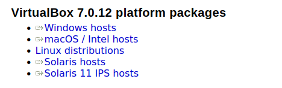
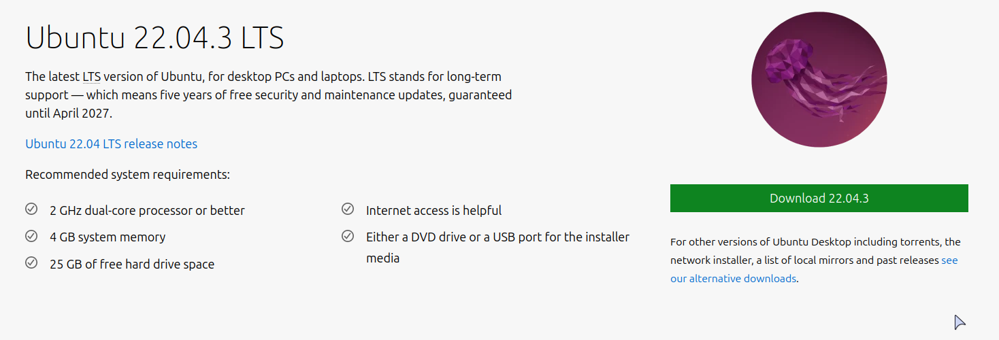
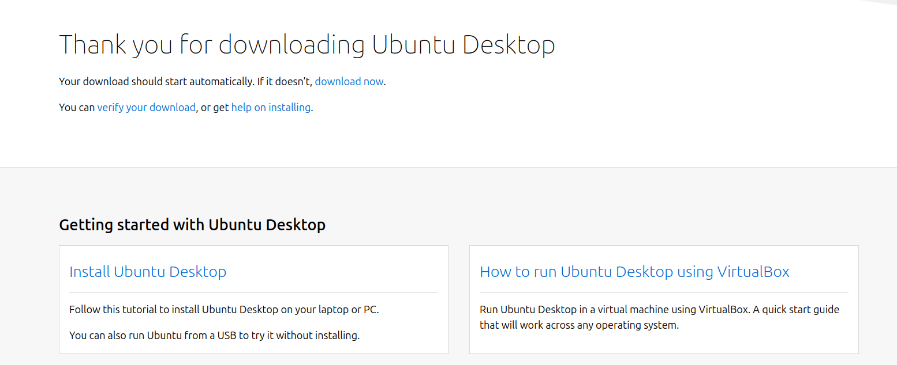

# Note for MacOS Users the content we teach will work on your machines out of the box give or take one or 2 commands, if you have an intel based mac(i.e you dont have M1 M2 CPUs) and you want to follow along then this guide will work for you 

# Installing VirtualBox with Ubuntu on Windows

This guide will walk you through the process of installing VirtualBox on a Windows machine and setting up an Ubuntu virtual machine (VM) within VirtualBox. This installation is intended for use in a Linux and command-line workshop. Before you start, please ensure your hardware meets the requirements and even it it doesnt then dont worry it will still work although a bit slowly.

### Also if you have a gaming laptop then skip this section your machine meets the requirements go straight to download.

## Hardware Requirements

Before proceeding, make sure your Windows computer meets the following hardware requirements:

-   **Processor**: A 64-bit processor with virtualization technology support (e.g., Intel VT-x or AMD-V). Most modern processors have this feature.
    
-   **Memory (RAM)**: A minimum of 4 GB of RAM is recommended for running a virtual machine, but having 8 GB or more will provide a smoother experience.
    
-   **Storage**: You need at least 10-20 GB of free disk space for VirtualBox and your virtual machines.
    
-   **Graphics**: Basic graphics capabilities are sufficient, but if you plan to use 3D acceleration in VMs, a more powerful GPU is beneficial.
    

## Installation Steps

### Step 1: Download VirtualBox

1.  Visit the [VirtualBox download page](https://www.virtualbox.org/wiki/Downloads) on your Windows machine.
    
2.  Under "VirtualBox 7.0.xx platform packages," click on the link for "Windows hosts" or "macOS/intel hosts" if on mac to download the installer.

    

### Step 2: Install VirtualBox

1.  Locate the downloaded installer and double-click it to start the installation process.
    
2.  Follow the on-screen instructions. You can accept the default settings during the installation.
    
3.  During the installation, you may be prompted to allow Oracle Corporation to install software on your computer. Accept this request.
    
4.  Once the installation is complete, you will be asked to restart your computer. It's recommended to do so.
    

### Step 3: Download Ubuntu ISO

1.  Download the Ubuntu Desktop ISO image from the [official Ubuntu website](https://ubuntu.com/download/desktop). Choose the LTS (Long Term Support).

2. An ISO fil will download, keep this safe and move it to some folder which you wont delete my mistake

### Step 4: Setting up ubuntu on Virtbox
1. Follow the official guide exactly and you should be fine 
\
[Setting up ubuntu on Virtbox](https://ubuntu.com/tutorials/how-to-run-ubuntu-desktop-on-a-virtual-machine-using-virtualbox#1-overview)

If all the steps were followed then you should endup with a working Virtual machine(VM) the rest we shall do during the workshop  

## P.S If you know docker then use that pull an ubuntu image and unminmize it, WSL(Windows subsystem for linux) will also work, the virtual box is only so that you get a feel for linux as a whole and its the most hassle free to setup.
